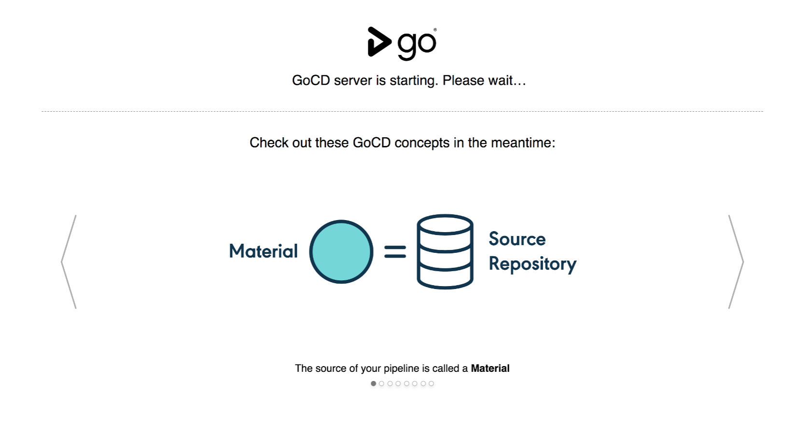
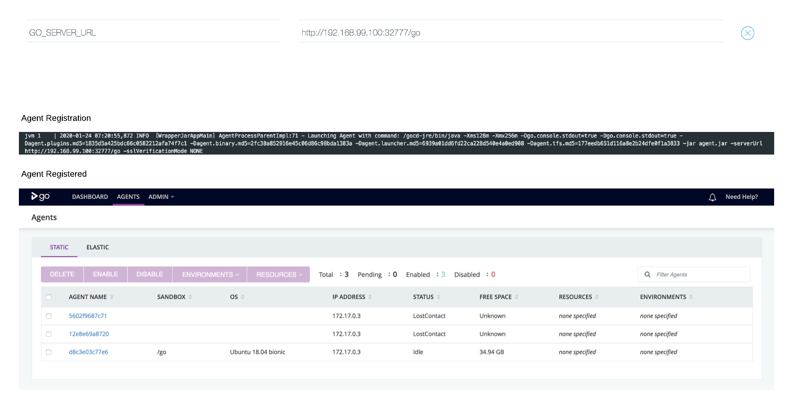
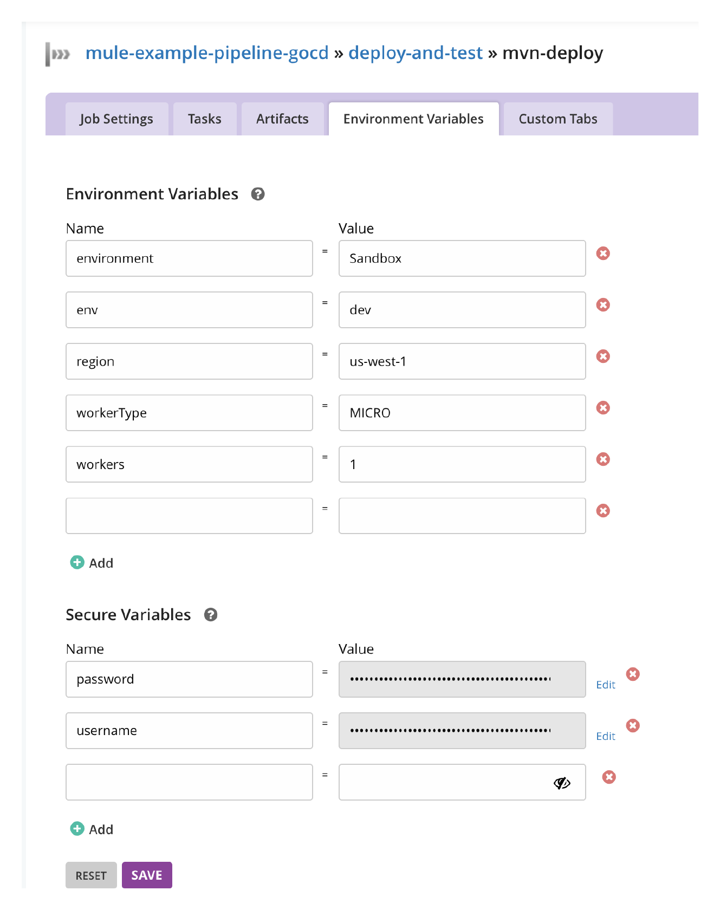
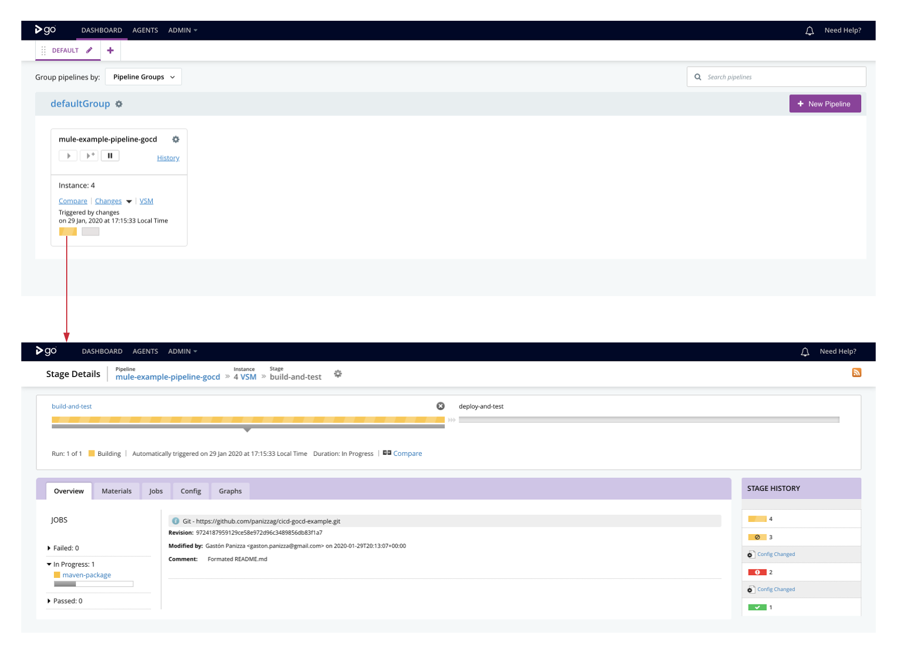
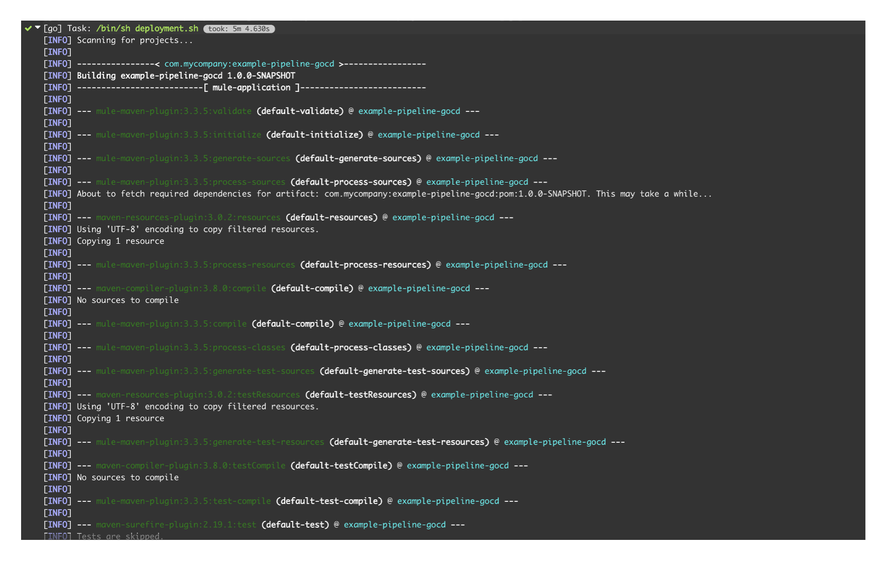
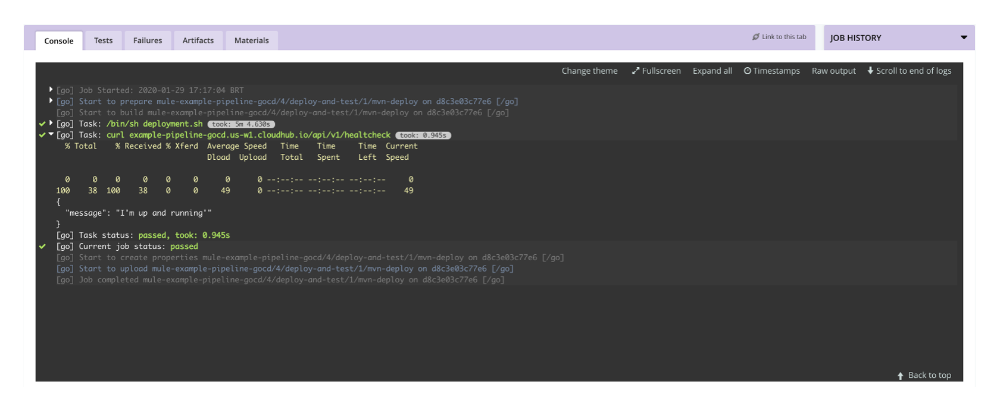

# GoCD Example Pipeline with Mule

A example pieline usign GoCD like CI Server tool.

# The example App
For this a simple Mule app will be used, containing:
   - HTTP Lister listening on port 8081
   - Path under /api/v1/
   - Only one resource called healthcheck which will be used for connectivity testing after deployment
   - Mule Maven Plugin with the cloudhubDeployment	configuration applied
   - MUnit simple test to perform MUnit testing before packaging the app


# Environment Config

For this example we will use a containairized version of GoCD Server and Agent, both created using a **Docker** image.

## GoCD Config

### Server Config

```
docker pull gocd/gocd-server
```

After running the image and accesing the UI url we'll get:

Once the server gets started, you'll see the following button in the upper center of the screen:


### Agent Config
A custom image based on Ubuntu was choosen because it contains Java and cUrl already installed and run under user root by default.
Alpine based and other official versions images are available too.

```
docker pull jrandall/gocd-agent-ubuntu-18.04-docker
```

Before starting the Agent make sure the GO_SERVER_URL environment variable is configured pointing to the image where the server is running.

During start up you should be able to check the logs of the image to see if the attachment is beign performed correctly. Also,
after started, you should be able to see the Agent listen on the "Agents" tab in GoCD main page



#### Installing Maven

```
apt update
```
```
apt install maven
```

After installed, verify it running
```
mvn -version
```

#### Downgrading to JDK 8 (Optional)
For this example we have as a prerequisite to use openjdk 8 instead of openjdk 11 so we need to downgrade the Open JDK version. The commands are:

```
apt-get install openjdk-8-jre
```
```
update-alternatives --config java
```

### Plugins Config (Optional)
There is a community plugin to run maven commands. This is out of scope of this article, however, just in case:
1) Download jar file from
https://github.com/ruckc/gocd-maven-plugin/releases/tag/0.1.1
2) Enter thee following location in container: /godata/plugins/external (Server)
3) Copy the jar in this location
4) Restart the server

# Pipeline Config

The propossed pipeline is a simple MVP to show how to integrate with Mule. This means we'll use one single pipeline with different stages on it. One single material configured (Github) will trigger the execution of this simple pipeline. 

- To create a pipeline click on "+ Add new pipeline"
	- First of all, configure a new material of type "git". Grab the repo url (HTTPS can be used) and paste it inside the Repository URL field
		- Test the connectivity to ensure you entered the proper URL
		- We'll skip advanced settings since this is a public repo that only contains one branch (master). However, consider that a more complex branching strategy will require more configuration
	- Enter the pipeline name. In this example we use the convention mule-${appName} to identify a mule app since the CI server can be used for other totally different purposes too.
		- Skip advanced settings since, again, the only parameters  we'll be using is the ones passed as argument for Deploy phase, and those can be environment variables inside the pipeline, instead arguments 

## Build Stage
This will package and test the application. For the sake of simplicity of this how-to, we'll keep the generated artifact in the GoCD filesystem, without versioning the binary using an external repo like Jfrog Artifactory or Nexus. However, it's strongly recommended to do that.
	
- The following configs should be configured as part of the pipeline config
	- Set Stage Name as "build-and-test" in the "Part 3: Stage Details"
		- We'll skip advance settings since we want to trigger the pipeline for every upcoming change notified by Github
	- Complete Part: Job and Tasks setting Job Name and giving "mvn package" as the command.
		- skip advanced settings since we don't need environment variables this time
	- Click on Save + Edit full config to configure the Deploy Stage

## Deploy Stage
This pipeline will get the packaged application (.jar) deloy it to Anypoint Platform and perform a quick connectivity healthcheck to ensure the application is up and running after deployment.
- From the pipeline configuration
	- Click on tab "Stages"
		- Click on "+ Add new stage"
			- Enter "deploy-and-test" as Job Name
			- Set Trigger Type as On Success and enabled check box "Allow Only On Success" to make sure this stage is only executed if build and test was succesfully
			- On Initial Job and Task
				- mvn-deploy for Job Name
				- Task Type "More"
				- On Lookup Commands enter Shell and select shell script
				- the command will be /bin/sh and the argument will be deployment.sh (this shellscrit will be provided by the application)
				- Click Save
		- Click on the deloy-and-test stage
			- Go to "Jobs"
				- Click on "mvn-deploy"
					- Click on "Environment Variables" tab
					- Enter the Mule Maven Plugin variables for the deloyment config. For example, for CloudHub:
						- environment (cloudhub)
						- env
						- region
						- workerType
						- workers
					- Add the needed secure variables. Following the exampple for a CloudHub deployment:
					    - username
						- password
					
					

					- Click "Save"
			- Click on the "Tasks" tab
				- Click on "+ Add new task", Click 'More"
					- On Command set "curl"
					- on Arguments set ${appName}-${region}.cloudhub.io or the convention used for the deployed application (depends on deployment model)
					- Check to run only if previous condition was passed (the deployment)
					- Click "Save"

					


# Running the pipeline

After configuring the pipeline you can go to "Dashboard" and click on the Start icon for your pipeline. Or simply change your code and push the changes to the Github repo so the pipeline can start.



Once complete the execution of the pipeline, you can check the output of each of the stages clicking on them. For example for deploy-and-test:





